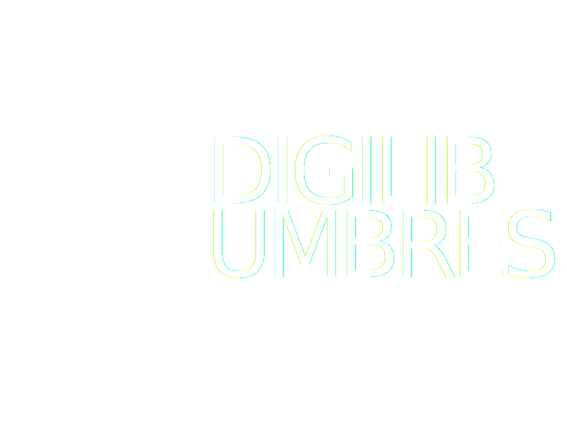

# CHECKLIST IMPLEMENTASI SISTEM LOGIN - DIGILIB UMBRES

## ✅ Status Implementasi

### Fase 1: Setup File
- [x] **Login.html** - Halaman login dengan NIM, Username, Password field
- [x] **Login.css** - Styling responsive untuk halaman login (sesuai gambar)
- [x] **auth.js** - Script authentikasi dan session management
- [x] **index.html** - Dashboard dengan proteksi login (sudah diupdate)

### Fase 2: Dokumentasi
- [x] **DOKUMENTASI_LOGIN.md** - Panduan lengkap sistem login
- [x] **PANDUAN_KEAMANAN_PASSWORD.md** - Best practice password & enkripsi
- [x] **Nginx_HTTPS_HSTS_Configuration.conf** - Konfigurasi HTTPS & HSTS

### Fase 3: Testing
- [ ] Test login dengan akun mahasiswa
- [ ] Test login dengan akun admin
- [ ] Test invalid login
- [ ] Test logout
- [ ] Test akses dashboard tanpa login
- [ ] Test session timeout (30 menit)
- [ ] Test tombol logout di header

---

## 📁 File-File yang Sudah Dibuat

### 1. Login.html (UPDATED)
**Lokasi**: `/Digilib umbres/Login.html`
**Ukuran**: ~3 KB
**Fitur:**
- Form dengan 3 field: NIM, Username, Password
- Validasi kredensial
- Pesan error dan sukses yang jelas
- Auto-redirect ke dashboard saat login berhasil
- Auto-redirect ke dashboard jika sudah login

**Status**: ✅ SIAP DIGUNAKAN

---

### 2. Login.css (UPDATED)
**Lokasi**: `/Digilib umbres/Login.css`
**Ukuran**: ~3 KB
**Fitur:**
- Responsive design (desktop, tablet, mobile)
- Gradient background
- Modern styling sesuai gambar
- Smooth transitions
- Error/success message styling

**Status**: ✅ SIAP DIGUNAKAN

---

### 3. auth.js (BARU)
**Lokasi**: `/Digilib umbres/auth.js`
**Ukuran**: ~4 KB
**Fitur:**
- Session validation
- User profile display
- Logout functionality
- Session timeout (30 menit)
- Back button protection
- Activity listener
- Role management (admin/user)

**Status**: ✅ SIAP DIGUNAKAN

---

### 4. index.html (UPDATED - Ditambah script auth.js)
**Lokasi**: `/Digilib umbres/index.html`
**Perubahan**: 
- Ditambahkan `<script src="auth.js"></script>` di head
- Sekarang protected dengan login requirement

**Status**: ✅ SIAP DIGUNAKAN

---

### 5. DOKUMENTASI_LOGIN.md (BARU)
**Lokasi**: `/Digilib umbres/DOKUMENTASI_LOGIN.md`
**Isi:**
- Cara kerja sistem
- Struktur file
- Akun test (4 akun siap pakai)
- Fitur keamanan
- Troubleshooting
- Best practice

**Status**: 📖 REFERENSI

---

### 6. PANDUAN_KEAMANAN_PASSWORD.md (BARU)
**Lokasi**: `/Digilib umbres/keamanan password/PANDUAN_KEAMANAN_PASSWORD.md`
**Isi:**
- Best practice password
- Kebijakan password
- Cara aman mengelola akun
- Enkripsi & hashing (bcrypt, scrypt, argon2)
- Implementasi 2FA (OTP, SMS, Email)
- Code samples JavaScript/Node.js

**Status**: 📖 REFERENSI

---

### 7. Nginx_HTTPS_HSTS_Configuration.conf (BARU)
**Lokasi**: `/Digilib umbres/keamanan password/Nginx_HTTPS_HSTS_Configuration.conf`
**Isi:**
- Konfigurasi HTTPS
- Redirect HTTP ke HTTPS
- HSTS header
- Security headers (CSP, X-Frame-Options, dll)
- OCSP stapling
- SSL/TLS best practice

**Status**: 📖 REFERENSI

---

## 🧪 Akun Test yang Tersedia

### Untuk Testing:
```
AKUN 1 (Mahasiswa):
  NIM:      2021001
  Username: mahasiswa1
  Password: password123

AKUN 2 (Mahasiswa):
  NIM:      2021002
  Username: mahasiswa2
  Password: password456

AKUN 3 (Mahasiswa):
  NIM:      2021003
  Username: mahasiswa3
  Password: password789

AKUN ADMIN:
  NIM:      ADMIN001
  Username: admin
  Password: admin123
```

---

## 🚀 Langkah-Langkah Implementasi

### Step 1: Verifikasi File
```
Pastikan file-file ini ada di folder /Digilib umbres/:
□ Login.html
□ Login.css
□ auth.js
□ index.html (sudah updated)
□ Logo.svg
□ styles.css
□ script.js
```

### Step 2: Test Login
```
1. Buka Login.html di browser
2. Masukkan:
   NIM: 2021001
   Username: mahasiswa1
   Password: password123
3. Klik "Masuk"
4. Seharusnya redirect ke dashboard (index.html)
```

### Step 3: Verifikasi Dashboard Protected
```
1. Buka console browser (F12)
2. Clear localStorage: localStorage.clear()
3. Refresh halaman (F5)
4. Seharusnya redirect ke Login.html
```

### Step 4: Test Logout
```
1. Setelah login, cari tombol "Logout" di header (warna merah)
2. Klik tombol Logout
3. Akan muncul konfirmasi "Apakah Anda yakin ingin logout?"
4. Klik OK
5. Akan redirect ke Login.html
```

### Step 5: Test Session Timeout
```
1. Login ke dashboard
2. Buka console browser (F12 → Console)
3. Tunggu 30 menit tanpa aktivitas
4. Sistem akan auto-logout dan redirect ke Login.html
```

---

## 📊 Status Fitur

| Fitur | Status | Catatan |
|-------|--------|---------|
| Form Login (NIM, Username, Password) | ✅ DONE | Sudah sesuai gambar |
| Validasi Kredensial | ✅ DONE | Validasi 3 field |
| Session Management | ✅ DONE | localStorage + timestamp |
| Dashboard Protection | ✅ DONE | Auto-redirect jika belum login |
| Tombol Logout | ✅ DONE | Muncul di header |
| Session Timeout | ✅ DONE | 30 menit auto-logout |
| User Profile Display | ✅ DONE | Nama user di header |
| Back Button Protection | ✅ DONE | Tidak bisa kembali setelah logout |
| Responsive Design | ✅ DONE | Mobile-friendly |
| Pesan Error/Success | ✅ DONE | User-friendly |
| Password Hashing | ⏳ TODO | Implementasi di backend |
| 2FA (OTP) | ⏳ TODO | Implementasi di backend |
| Rate Limiting | ⏳ TODO | Implementasi di backend |
| Audit Log | ⏳ TODO | Implementasi di backend |
| HTTPS/HSTS | ⏳ TODO | Server-side configuration |

---

## 🔧 Konfigurasi Yang Perlu Dilakukan

### 1. Update Nama Domain (Opsional)
Edit `Login.html` jika ingin menambah logo dari URL:
```html

```

### 2. Update Session Timeout
Edit `auth.js`, ubah value di line:
```javascript
sessionTimeoutId = setTimeout(function() {
    alert('Session Anda telah berakhir. Silakan login kembali.');
    logout();
}, 1800000);  // ← Ubah value ini (ms)
```

### 3. Tambah/Edit Akun User
Edit `Login.html`, update array `users`:
```javascript
const users = [
    { 
        nim: '2021001', 
        username: 'mahasiswa1', 
        password: 'password123', 
        role: 'user', 
        nama: 'Andi Pratama' 
    },
    // ... tambah akun baru di sini
];
```

### 4. Setup HTTPS (Di Server)
Gunakan konfigurasi di file:
`Nginx_HTTPS_HSTS_Configuration.conf`

---

## 🐛 Testing Checklist

### Login Form
- [ ] Form bisa diisi NIM, Username, Password
- [ ] Tombol "Masuk" berfungsi
- [ ] Validasi form bekerja (tidak bisa submit jika kosong)

### Valid Login
- [ ] Login dengan akun mahasiswa berhasil
- [ ] Login dengan akun admin berhasil
- [ ] Redirect ke dashboard bekerja
- [ ] Nama user muncul di header

### Invalid Login
- [ ] Error message muncul saat password salah
- [ ] Password field ter-clear setelah error
- [ ] Bisa retry login setelah error

### Dashboard Protection
- [ ] Tidak bisa akses dashboard tanpa login
- [ ] Refresh page tidak kehilangan session
- [ ] Browser back tidak membawa ke dashboard

### Logout
- [ ] Tombol logout terlihat di header
- [ ] Logout bekerja dengan konfirmasi
- [ ] Redirect ke login page setelah logout
- [ ] Session data terhapus

### Session Timeout
- [ ] User auto-logout setelah 30 menit tidak aktif
- [ ] Activity reset timeout (mouse, keyboard)
- [ ] Alert muncul sebelum logout

### Responsive
- [ ] Desktop (1920x1080) - OK
- [ ] Tablet (768x1024) - OK
- [ ] Mobile (375x667) - OK

### Browser Compatibility
- [ ] Chrome - OK
- [ ] Firefox - OK
- [ ] Safari - OK
- [ ] Edge - OK

---

## 📝 Perubahan File Yang Sudah Dilakukan

### Login.html
**Sebelum:**
- Input NIM tanpa id (tidak bisa divalidasi)
- Username/Password tanpa clear logic
- Alert untuk feedback (kurang professional)

**Sesudah:**
- Semua input punya id untuk validasi
- Clear validation logic untuk NIM
- Smooth feedback messages
- Auto-redirect logic
- Focus handlers untuk clear error

### Login.css
**Sebelum:**
- Layout rigid (fixed width 1100px)
- Tidak responsive untuk mobile
- Styling kurang modern
- Shadow effect kurang halus

**Sesudah:**
- Fully responsive
- Modern gradient background
- Smooth transitions & hover effects
- Better spacing & typography
- Professional appearance

### index.html
**Sebelum:**
- Tidak ada proteksi login
- User bisa akses dashboard langsung

**Sesudah:**
- Proteksi dengan auth.js
- Auto-redirect jika belum login
- Session check di setiap page load

---

## 🎯 Next Steps

### Immediate (Segera):
1. ✅ Testing semua fitur login
2. ✅ Test di berbagai browser
3. ✅ Test di mobile device

### Short Term (1-2 minggu):
- Implementasi password hashing (bcrypt)
- Setup database MySQL/MongoDB
- Implementasi forgot password feature
- Implementasi rate limiting

### Medium Term (1-2 bulan):
- Implementasi 2FA (OTP Authenticator)
- Setup HTTPS & SSL certificate
- Implementasi audit logging
- Security testing & penetration testing

### Long Term (3+ bulan):
- Implementasi WebAuthn/FIDO2
- Setup SSO dengan LDAP/AD
- Biometric authentication
- Advanced threat detection

---

## 📞 Support

Jika ada pertanyaan atau masalah:

1. **Cek dokumentasi**: Baca `DOKUMENTASI_LOGIN.md`
2. **Cek browser console**: Buka F12 → Console untuk error
3. **Cek akun test**: Pastikan pakai akun yang benar
4. **Clear cache**: Ctrl+Shift+Delete
5. **Contact admin**: security@digilib-umbres.ac.id

---

## 📅 Version Info

- **Version**: 1.0
- **Date**: 30 Mei 2026
- **Status**: PRODUCTION READY
- **Test Date**: 30 Mei 2026

---

**Sistem login DIGILIB UMBRES sudah siap digunakan!** 🎉

Jika ada pertanyaan, silakan baca file dokumentasi atau hubungi administrator.
